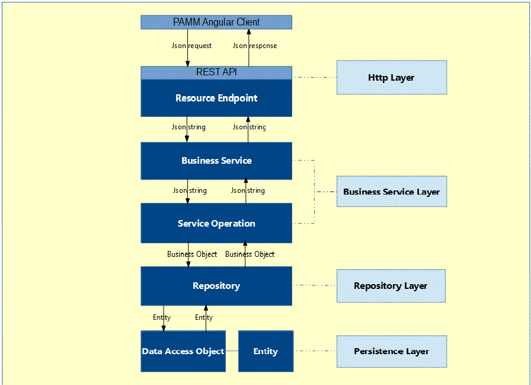

PAMM - SEED
-----------

PAMM-SEED is a template for building Web Applications using the PAMM stack:

-   [Play](https://www.playframework.com/) for server side web pages and services

-   [AngularJS](https://angularjs.org/) for client side rich user interfaces

-   [MariaDb](https://mariadb.org/) for relational data

-   [MongoDb](https://www.mongodb.org/community) for document based non-relational data

Index
-----

**1. Architecture**

**2. Play Component**

    1.  Controllers

    2.  Business Service Layer

    3.  Data Persistence Layer

**3. Angular Component**

**4. Testing**

    1.  Javascript Unit Testing

    2.  Java Unit Testing

    3.  End to End Testing

1. Architecture
---------------

The following diagram shows the high level reference architecture for the application: 

2. Play Component
-----------------

The Play component of the PAMM seed consists of the following component layers:

**1. Controllers**

The Controller layer exposes the applications RESTful API to clients, facilitated by the [Play framework routing mechanism](https://www.playframework.com/documentation/2.4.3/JavaRouting). Each controller exposes a RESTful API for a single application resource.

The Controllers responsibility is to accept requests for a resource and then delegate the processing of that request to a Business Service Layer component. The Transactional boundary for the processing of a request is defined on the Controller.

**2. Business Service Layer**

The Business Service layer services provide a [façade](https://en.wikipedia.org/wiki/Facade_pattern) style interface to a number of underlying service operations. Each service is an aggregation of service operations, with each service operation providing business logic to maintain application resources.

Each service operation should inherit from the ServiceOperation superclass, with any system "cross cutting" behaviour (e.g. application level authentication and authorization, audit, error handling) being invoked by the ServiceOperation superclass. Comments have been included in this class as a placeholder for this logic to be included if required.

**3. Data Persistence Layer**

The Data / Persistence layer provides the application persistence mechanism and its data model. This seed uses JPA with a Hibernate implementation to persist data to an in-memory H2 database. 

**3.1 Configuration**

This requires the following configuration (already set up in the seed).

a) conf/application.conf - Defines configuration for the Datasource to access the H2 database. Specifies the jdbc url, the jndi name for the Datasource, the H2 database driver.

The default persistence unit for the application is also defined in the application.conf file by setting the jpa.default property. When play.db.jpa.JPA.em() is invoked with no arguments, it will return an Entity manager for this default persistence unit. 

b) conf/META-INF/persistence.xml - Defines the persistence unit for the application, specifying Hibernate as the persistence provider and referencing the H2 database datasource.

c) build.sbt - include the dependencies for javaJpa and hibernate.

**3.1 High Level Class Structure**

*GenericReadOnlyDao*: Base class for all application Data access objects, providing methods to find, list and search for entities. An EntityManager instance is made available through the EntityManagerProvider factory class. This is obtained from the play.db.jpa.JPA.em() static method returning an entity manager instance for the currently running thread.

*GenericDao*: Provides generic methods to create, update and delete entities.

*EntityManagerProvider*: Factory class to encapsulate the play.db.jpa.JPA functions. Returns the entity manager instance for the currently running thread.

Any specific queries required for any of the entities should be placed in the Dao associated with that entity. E.g. If the ProjectEntity requires any database queries not included in the Generic Dao classes, then methods for these database queries should be added in the ProjectDao class.

3. Angular Component
--------------------

In Development

4. Testing
----------

In Development
